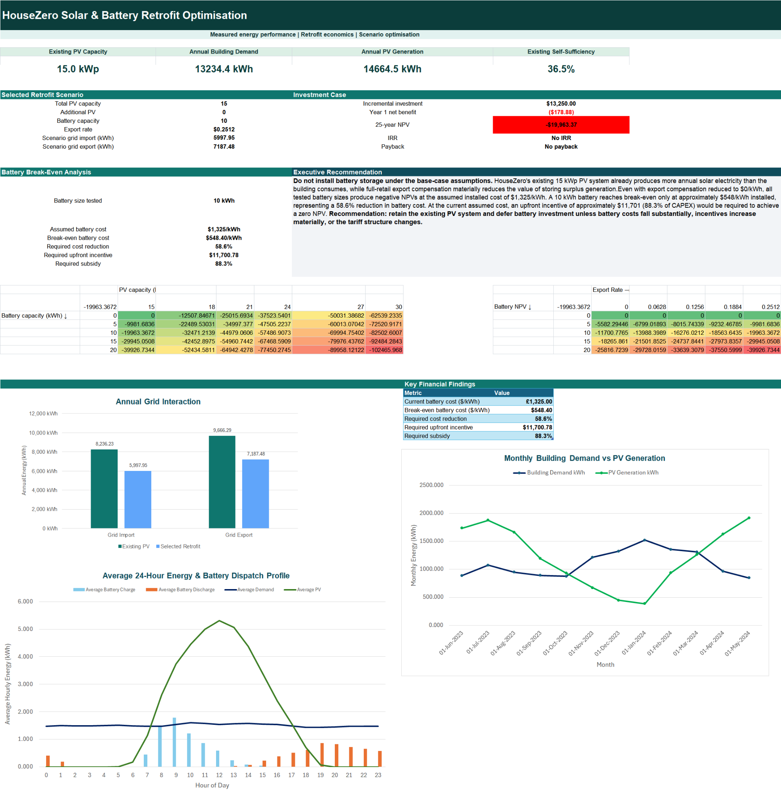
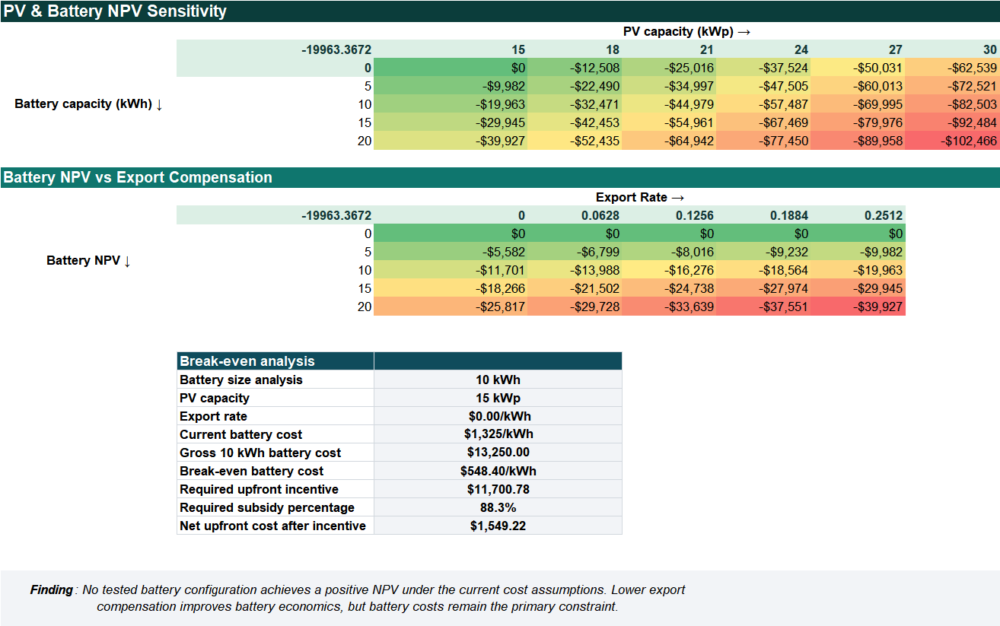
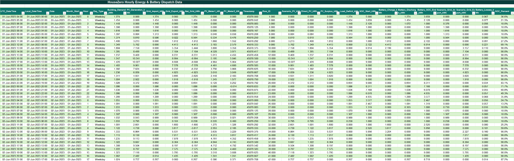
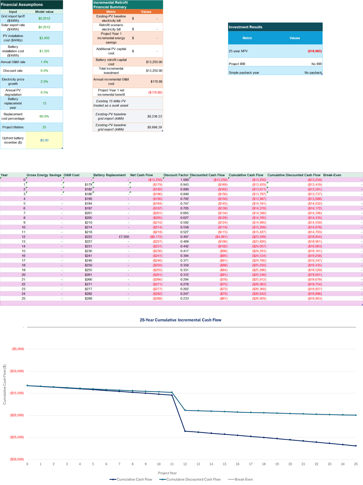

# HouseZero Solar & Battery Retrofit Optimisation

An Excel engineering-finance model evaluating whether Harvard HouseZero should add rooftop solar PV and/or battery storage to its existing system. The project combines **8,784 hourly observations**, structured battery-dispatch formulas, named ranges, Power Query, financial appraisal and two-variable scenario analysis.

## Project objective

The model tests how additional PV and battery capacity affect:

- grid imports and exports;
- direct solar self-consumption;
- battery charging/discharging and state of charge;
- self-sufficiency;
- 25-year NPV, IRR and payback;
- break-even battery economics under different export-compensation assumptions.

The existing **15 kWp PV system is treated as a sunk asset**, so the financial model evaluates only incremental retrofit economics.

## Data and model setup

The workbook uses measured HouseZero hourly energy data from **1 June 2023 to 31 May 2024**. Power Query connections include `q_Loads_Raw` and `q_Loads_Clean`.

Base assumptions stored in `Sources_Assumptions` include:

| Input | Base value |
|---|---:|
| Existing PV capacity | 15 kWp |
| Grid import tariff | $0.2512/kWh |
| Base export rate | $0.2512/kWh |
| PV installed cost | $3,450/kWp |
| Battery installed cost | $1,325/kWh |
| Annual O&M | 1.35% of CAPEX |
| Discount rate | 6.0% |
| Electricity-price growth | 2.0% |
| PV degradation | 0.5%/yr |
| Battery replacement | Year 12 |
| Replacement cost | 60% of initial battery CAPEX |
| Project life | 25 years |

The workbook uses named ranges for the main modelling inputs, including `Existing_PV_kWp`, `Scenario_PV_kWp`, `Battery_Capacity_kWh`, `Import_Tariff`, `Export_Rate`, `Discount_Rate`, `Charge_Efficiency`, `Discharge_Efficiency`, `Minimum_SOC`, `Maximum_SOC` and `Project_Life`.

## Cached findings

The baseline energy profile in the uploaded model reports approximately:

- **13,234 kWh** annual building demand;
- **14,665 kWh** annual PV generation;
- **36.5%** existing self-sufficiency.

For the selected **15 kWp PV + 10 kWh battery** scenario:

- grid import falls to about **5,998 kWh**;
- grid export falls to about **7,187 kWh**;
- the battery charges about **2,479 kWh** and discharges about **2,238 kWh** over the model year;
- the incremental investment is **$13,250**;
- year-1 net benefit is negative after O&M;
- 25-year NPV is approximately **-$19,963**;
- the model returns **No IRR** and **No payback**.

The scenario sheet states that **no tested battery configuration produces a positive NPV under the current cost assumptions**. Lower export compensation improves the relative value of storage, but not enough to overcome installed battery cost in the tested cases.

## Workbook structure

| Worksheet | Role |
|---|---|
| `README` | Project overview, questions and headline finding |
| `Dashboard` | Executive energy and investment summary |
| `Model_Inputs` | System settings and baseline/scenario energy outputs |
| `Financial_Model` | Incremental CAPEX, annual cash flows, NPV, IRR and payback |
| `Scenario Analysis` | PV/battery NPV matrix, export-rate sensitivity and break-even analysis |
| `Methodology` | Data, dispatch logic, financial methodology and limitations |
| `Hourly_Data` | 8,784-hour demand, PV and battery dispatch calculations |
| `Sources_Assumptions` | Source register and modelling assumptions |
| `Chart Support` | Pivot/support data for dashboard charts |

## Dashboard walkthrough

### Scenario analysis

### Hourly calculation layer

### Financial model

## Auditability

The model uses named ranges, a dedicated source/assumption register, structured Excel table formulas and explicit battery operating constraints. Assumptions are kept outside the annual cash-flow calculations and scenario inputs are separated from result cells.

See [Formula, Query & Model Guide](docs/FORMULA_GUIDE.md), [Workbook Architecture](docs/WORKBOOK_ARCHITECTURE.md) and [Data Sources](docs/DATA_SOURCES.md).

## Files

- [`workbook/HouseZero_Solar_Battery_Optimisation_Portfolio.xlsx`](workbook/HouseZero_Solar_Battery_Optimisation_Portfolio.xlsx) - cached portfolio workbook
- [`docs/HouseZero_Project_Summary.pdf`](docs/HouseZero_Project_Summary.pdf) - 3-page project summary
- [`docs/FORMULA_GUIDE.md`](docs/FORMULA_GUIDE.md) - dispatch, financial and scenario logic
- [`docs/WORKBOOK_ARCHITECTURE.md`](docs/WORKBOOK_ARCHITECTURE.md) - workbook/model map
- [`docs/DATA_SOURCES.md`](docs/DATA_SOURCES.md) - source and assumption documentation

## Limitations

- Historical demand and PV production are used as the representative operating year.
- The model is an investment-screening tool rather than a detailed electrical-engineering design.
- Battery dispatch is deterministic and does not optimise against hourly price signals.
- The base export rate is a modelling assumption and has a large effect on storage economics.
- Future CAPEX, degradation, replacement cost, tariffs and policy outcomes are uncertain.
- The project does not model resilience value, outage value or non-financial benefits unless explicitly reflected in cash flows.

**Tools demonstrated:** Excel 365, Power Query, named ranges, structured table formulas, PivotTables, Excel Data Tables, Goal Seek/break-even analysis and discounted cash-flow modelling.